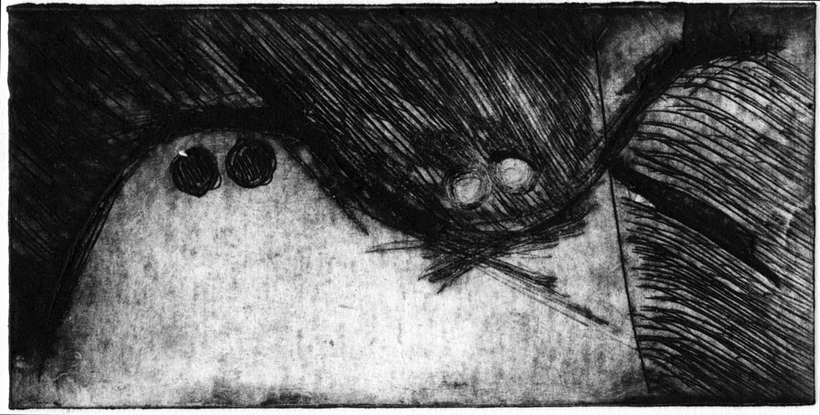

Title: Over-Under-Through
Thread-ID: mt_3435
Path-Alias: /d/sketchbook-over-under-through.php
Path-Alias: /d/20101230.php
Date: 2010-12-30 00:00:00-07:00
Entry-ID: 4506
UUID: 47fc7fe8-66a6-4b52-8024-6a367e60eff9

 A milk-carton "lithograph"

.....

While on a vacation I went to my mom's print studio, where we made some prints with easy-to-use materials.  This was done by scratching lines into the inside of a milk carton.  It took a lot longer to ink the "plate" than it did to "etch" it.
